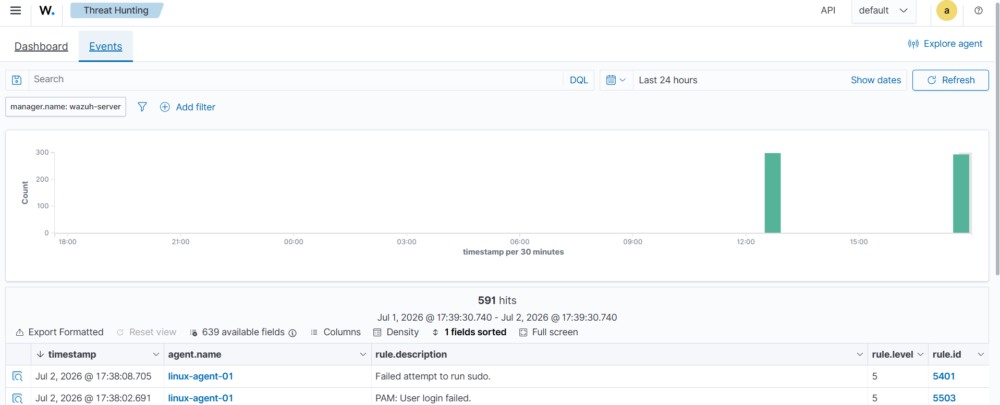

# Blue Team Lab: Wazuh SIEM con agente Linux

Laboratorio local de ciberseguridad defensiva construido con VirtualBox, Ubuntu Server y Wazuh. El objetivo fue simular un entorno basico de monitoreo tipo SOC, registrar un endpoint Linux como agente y validar que los eventos de autenticacion llegan al dashboard para su analisis.

> Proyecto educativo y etico. No se usaron sistemas de terceros, malware real ni redes externas para generar eventos de seguridad.

## Objetivos

- Construir un laboratorio Blue Team aislado usando maquinas virtuales.
- Instalar un Wazuh Manager con dashboard web.
- Conectar un endpoint Linux mediante Wazuh Agent.
- Generar eventos controlados de autenticacion fallida.
- Analizar alertas desde la vista Threat Hunting.
- Documentar evidencia como si fuera un caso inicial de SOC.

## Arquitectura

```text
Windows Host
|
|-- Navegador web
|   |-- Acceso al dashboard: https://WAZUH_MANAGER_IP
|
|-- VirtualBox Host-only Network: LAB_HOST_ONLY_NETWORK
    |
    |-- BT-Wazuh-Ubuntu
    |   |-- Rol: Wazuh Manager, Indexer y Dashboard
    |   |-- IP host-only: WAZUH_MANAGER_IP
    |
    |-- BT-Linux-Agent
        |-- Rol: endpoint Linux monitoreado
        |-- Hostname: linux-agent-01
        |-- Wazuh Agent: activo
```

Ver diagrama en [diagrams/architecture.md](diagrams/architecture.md).

## Herramientas usadas

| Herramienta | Uso |
| --- | --- |
| Oracle VirtualBox | Virtualizacion del laboratorio |
| Ubuntu Server 24.04 LTS | Sistema base para manager y agente |
| Wazuh 4.14 | SIEM/XDR open source |
| Wazuh Agent | Recoleccion de eventos del endpoint |
| Linux systemd/journal/PAM/sudo | Fuentes de eventos de autenticacion |

## Evidencia principal

El agente `linux-agent-01` quedo activo y generando alertas de autenticacion:



Alertas observadas:

| Rule ID | Descripcion | Nivel | Agente |
| --- | --- | --- | --- |
| 5401 | Failed attempt to run sudo. | 5 | linux-agent-01 |
| 5503 | PAM: User login failed. | 5 | linux-agent-01 |

## Documentacion

- [docs/01-lab-setup.md](docs/01-lab-setup.md): creacion del laboratorio y red segura.
- [docs/02-wazuh-agent-install.md](docs/02-wazuh-agent-install.md): instalacion del agente Linux.
- [docs/03-authentication-detection.md](docs/03-authentication-detection.md): primer ejercicio de deteccion.
- [incident-reports/IR-001-failed-sudo.md](incident-reports/IR-001-failed-sudo.md): mini reporte estilo SOC.
- [scripts/](scripts/): scripts auxiliares para ejecutar ejercicios con menos comandos manuales.
- [docs/github-linkedin-guide.md](docs/github-linkedin-guide.md): como presentar este proyecto en GitHub y LinkedIn.

## Resultado

El laboratorio quedo funcional con un manager Wazuh y un endpoint Linux reportando eventos. Se valido el flujo defensivo:

```text
Accion en endpoint -> Log local -> Wazuh Agent -> Wazuh Manager -> Regla -> Alerta -> Analisis
```

## Aprendizajes

- Diferencia entre Wazuh Manager, Dashboard y Agent.
- Uso de red Host-only para mantener el laboratorio aislado del resto de la red.
- Validacion de conectividad entre VMs.
- Instalacion y arranque de servicios con `systemctl`.
- Interpretacion basica de alertas por autenticacion fallida.
- Documentacion de evidencia para portafolio Blue Team.

## Seguridad del laboratorio

- Las pruebas se hicieron dentro de maquinas virtuales.
- La red Host-only limita el alcance a host y VMs locales.
- No se publican contrasenas, tokens, llaves ni credenciales del dashboard.
- Las capturas incluidas fueron revisadas para evitar exponer secretos.
