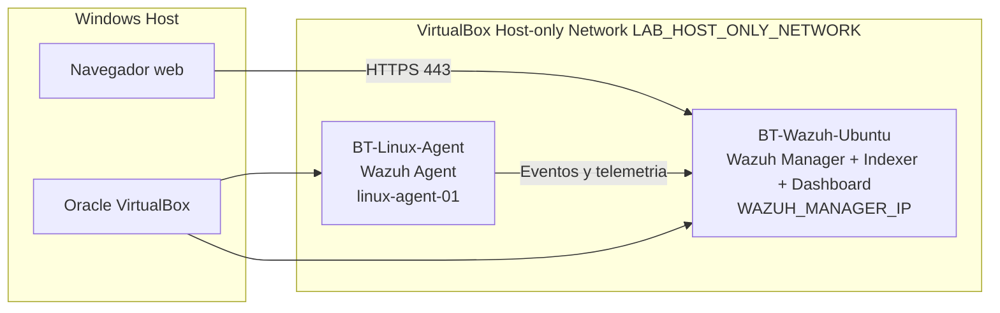

# Arquitectura del laboratorio

## Roles

| Componente | Rol |
| --- | --- |
| Windows Host | Equipo anfitrion y navegador para entrar al dashboard |
| BT-Wazuh-Ubuntu | Servidor central de Wazuh |
| BT-Linux-Agent | Endpoint Linux monitoreado |
| Red Host-only | Segmento local aislado para comunicacion entre host y VMs |

## Por que Host-only

La red Host-only permite que el host Windows y las maquinas virtuales se comuniquen entre si sin exponer los servicios del laboratorio a la red externa. Para un laboratorio inicial de Blue Team, esto reduce el riesgo y facilita controlar el alcance de las pruebas.
