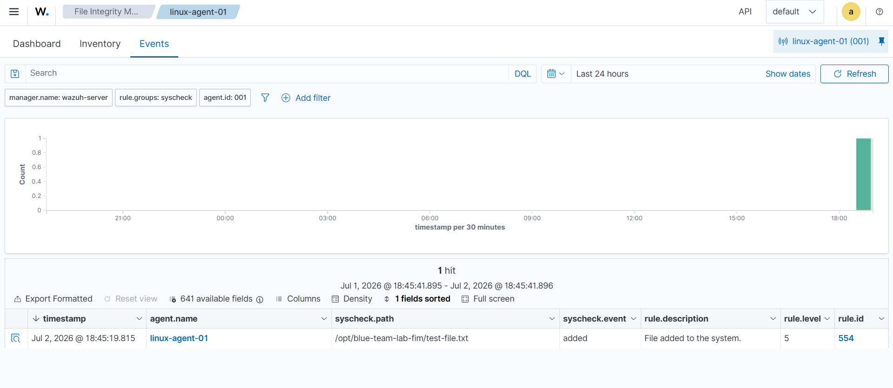

# 04 - File Integrity Monitoring

## Objetivo

Validar que Wazuh detecta cambios en archivos de un endpoint Linux usando el modulo File Integrity Monitoring.

## Escenario

Se configuro una carpeta de laboratorio en el agente Linux para monitoreo en tiempo real:

```text
/opt/blue-team-lab-fim
```

Luego se creo un archivo de prueba para confirmar que Wazuh genera una alerta cuando aparece un archivo nuevo.

## Automatizacion usada

Para evitar ejecutar varios comandos manuales, se creo un script auxiliar:

```bash
curl -sLO https://raw.githubusercontent.com/Maicolfelix/blue-team-wazuh-lab/master/scripts/fim-realtime-lab.sh
sudo bash fim-realtime-lab.sh
```

El script realiza estas acciones:

- Crea la carpeta de laboratorio.
- Crea backup de `ossec.conf`.
- Agrega la carpeta al bloque `syscheck` con `realtime="yes"`.
- Reinicia el servicio `wazuh-agent`.
- Genera un archivo de prueba.

## Alerta observada

| Campo | Valor |
| --- | --- |
| agent.name | linux-agent-01 |
| syscheck.path | /opt/blue-team-lab-fim/test-file.txt |
| syscheck.event | added |
| rule.description | File added to the system. |
| rule.id | 554 |
| rule.level | 5 |

## Evidencia



## Interpretacion

Wazuh detecto que se agrego un nuevo archivo en una ruta monitoreada por FIM. En un ambiente real, este tipo de alerta puede ser relevante si ocurre en rutas sensibles como configuraciones de servicios, binarios del sistema, llaves SSH o archivos de usuarios privilegiados.

## Preguntas de triage

- Que archivo cambio?
- En que host ocurrio?
- El cambio fue esperado?
- Que usuario o proceso genero el cambio?
- La ruta monitoreada es critica?
- Hubo otros eventos cercanos, como autenticacion fallida o ejecucion de comandos con privilegios?

## Conclusion

La prueba confirma que el agente Linux envia eventos de integridad de archivos al Wazuh Manager y que el dashboard permite investigar cambios desde la vista File Integrity Monitoring.

